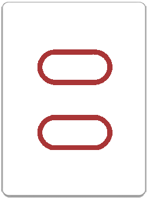
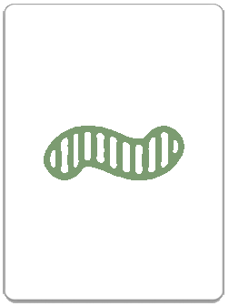

# Unit1Proj-Set

## Synopsis

Thank you for following the directions and "READing ME".  

This is a simple web app to simultate playing SET, which is pretty much the best game.  It's a matching game, but you have to match 3 cards that either all share or all differ in the 4 attributes that exist on each card (color, number of symbols, shading, and shape).  here are some examples:

#### Here are some examples of SETs
<table>
	<tr>
		<td></td>
    <td></td>
    <td></td>
  </tr>
  <tr>
    <td colspan="3" class="dirTablesText">
			<p>All the same: Red, Oval, 2 Symbols</p>
			<p>All different: Shading</p>
		</td>
	</tr>	
</table>
<table class="dirTables">
	<tr>
		<td></td>
		<td></td>
		<td></td>
	</tr>
	<tr>
		<td colspan="3" class="dirTablesText">
		  <p>All the same: Striped</p>
			<p>All different: Colors, Shapes, # of Symbols</p>
		</td>
	</tr>	
</table>

#### Here are some examples that are NOT SETs
<table class="dirTables">
	<tr>
		<td></td>
		<td></td>
		<td></td>
	</tr>
	<tr>
		<td colspan="3" class="dirTablesText">
			<p>All the same: Diamonds, 2 Symbols</p>
			<p>All different: Colors</p>
			<p>Why not?: Two are outlined and one is solid</p>
		</td>
	</tr>	
</table>
<table class="dirTables">
	<tr>
		<td></td>
		<td></td>
		<td></td>
	</tr>
	<tr>
		<td colspan="3" class="dirTablesText">
			<p>All the same: Squiggle, 2 Symbols</p>
			<p>All different: Shading</p>
			<p>Why not?: Two are red and one is green</p>
		</td>
	</tr>	
</table>

## Code Example

There's a lot of showing/hiding/getting in the code depending on what players should see at different points in the game.  For example, when you add an extra column (if you don't see a SET in 4 columns) or when there aren't any cards left in the deck, I hid the xCol button...stuff like that should be easy to spot in the code. 

The most useful snippets of code might have to do with how I load the board with images.  the loadBoardArray always has 15 values stored in it, usually 12 objects from the deck array and 3 strings called "empty".  The empty indices are replaced byimages if an extra column is requested by the players.  I actually created a blank image with the same dimensions as the cards to avoid strange loading/logical errors when the game is near the end and there need to be blank spaces on the board.  When the array value is "empty", a transparent image will be inserted into the corresponding div.

```
//boardSize should be 12 or 15, dude
var loadOnBoardArray = function(boardSize){
	for(var i = 0;i<boardSize;i++){	
		if(onBoardArray[i]==="empty"){
			if(deck.length>0){
				onBoardArray[i] = deck.pop();
			} 
		}
	} 
}; 

//board size should be 12 or 15, dude
var loadBoard = function(boardSize){
	for(var i = 0;i<boardSize;i++){
		if(onBoardArray[i]==="empty"){
			boardElem[i].children('img').attr('src', "img/emptyImage.png");
		} else{
		boardElem[i].children('img').attr('src', "img/" + onBoardArray[i].imageURL);
		}
	} //maybe add ignore error when it doesn't find the last 3
	updateScoreBoard();
};
```

There are also a series of functions that get used to check if a player's selection is a SET.  The checkForSet function references a couple of global variables (current player and playerSelection are modified by click events to iniate the play), checks each of the 4 qualities for a set, adds a description of the match/non-match to the playerSelection array, and returns true or false.  If it is a set, it's moved into that player's array (which would be their pile of sets in real life).  The descriptions get used on the checkForSetMessage modal and moving the sets also initiates either moving 3 new cards onto empty spaces on the board from the deck, or reshuffling the remaining cards in the xCol to fit onto 12 spaces again.  

```
var checkQuality = function(quality){
	if(playerSelection[1][quality]===playerSelection[2][quality] 
		&& playerSelection[1][quality]===playerSelection[3][quality]){
		playerSelection[4][quality] = "All the Same";
		return true;
	} else if(playerSelection[1][quality]!==playerSelection[2][quality] 
		&& playerSelection[1][quality]!==playerSelection[3][quality]
		&& playerSelection[2][quality]!==playerSelection[3][quality]){
		playerSelection[4][quality] = "All Different";
		return true;
	} else {
		playerSelection[4][quality] = "Not a SET";
		return false;
	}
}; 

//moves set from onBoardArray to p#Sets
var moveSet = function(playerSets){
	playerSets.push(playerSelection);
	for(var i = 1; i<4; i++){
		for(var j = 0;j<onBoardArray.length;j++){
			if(onBoardArray[j].imageURL===playerSelection[i].imageURL){
				onBoardArray[j]="empty";
			}
		}
	} 
	for(var i = 12; i<15;i++){
		for(var j = 0;j<12;j++){
			if(onBoardArray[j]==="empty"){
				onBoardArray[j]=onBoardArray[i];
				onBoardArray[i]="empty";
			}
		}		
	}
};

var checkForSet = function(){
	var checkColor = checkQuality("color");
	var checkShading = checkQuality("shading");
	var checkShape = checkQuality("shape");
	var checkNumber = checkQuality("number");
	if(checkColor && checkShape && checkShading && checkNumber){	

		if(currentPlayer===1){
			moveSet(p1Sets);
		} else if(currentPlayer===2){
			moveSet(p2Sets);
		} else if(currentPlayer===3){
			moveSet(p3Sets);
		}
		checkSetMessage(currentPlayer, true);
		return true;
	} else{
		if(currentPlayer===1){
			p1WrongAns++;
		} else if(currentPlayer===2){
			p2WrongAns++;
		} else if(currentPlayer===3){
			p3WrongAns++;
		}		
		checkSetMessage(currentPlayer, false);
		return false;	
	}
};
```

## Motivation

This is project 1 for my coding bootcamp at General Assembly Seattle.  I chose this game because I adore it, know it really well, and knew that some of the logic was going to be complex enough to stretch me in a few ways I wanted to be stretched.  

I first played this game when I was in my mid-twenties and went to have dinner with a family whose children I used to coach on a swim team at the YMCA in Brighton, MA.  After we ate, they introduced the game and we all had a super fun time playing...and their 11-year old kicked my butt.  

The addition of "simple mode" as well as the detailed play summary after each round were designed as tools to help a beginner player get better quickly, so they can practice and ultimately defeat any tween contenders they might encounter.

## Installation

It's a small, single page, front-end web app so you can just download the files and run them from your local machine, though the data for the cards is stored in a couple of JSON files so you'll need to run a server for things to work right.  At different points in the project, I used [Python Simple Server](http://www.pythonforbeginners.com/modules-in-python/how-to-use-simplehttpserver/) and [Node](https://nodejs.org/en/).

## Tests

There is a "simple mode" that can be accessed by clicking the low, right hand corner of the window.  This is a great way to test game behaviors because it makes the deck 1/4 of the size and gets you "closer" to the end of the game.  

What else are you trying to test?  Just play the game.  It's fun.

## Contributors

I made the bulk of the code but snagged some of the images from this guys's [phd thesis poster] (https://d2r55xnwy6nx47.cloudfront.net/uploads/2016/05/SETPoint_2000.png) and photoshopped them to match my theme.  I also jused JQuery, JQueryUI, and Bootstrap so the folks that made those deserve an honorable mention as well.

## License

This web game is free to play, but you should probably go buy the card game directly from the creators [HERE](https://www.setgame.com/set) since it came from their brains.  For goodness sake if you take this code and try to make money with it, make sure you get their permission and pay them for their creative property.